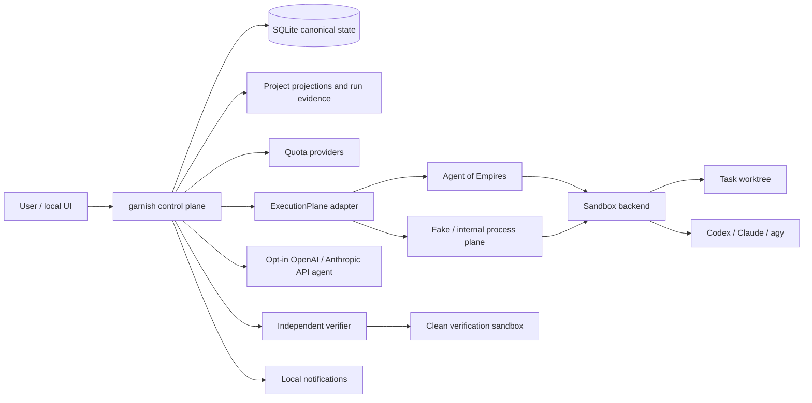
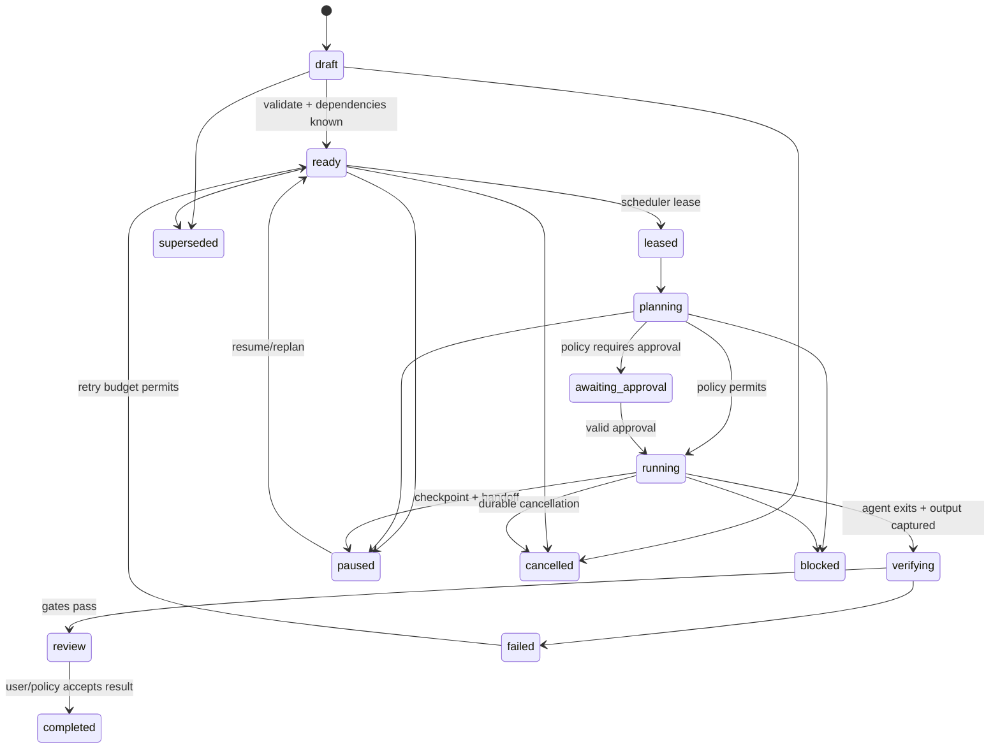

# Architecture

## Design principles

1. Policy, state transitions, and verification are deterministic wherever possible.
2. Agents propose actions; they do not authorise themselves or mark their own work verified.
3. Canonical state is transactional. Markdown and logs are projections or evidence.
4. Every external integration is capability- and version-declared.
5. Long work is bounded, checkpointed, cancellable, and resumable from evidence.
6. Isolation claims describe inspected runtime properties, not product names.
7. Provider quota and API cost remain distinct resources.

## System context

## Boundaries

### Control plane

The Rust `garnish` process owns:

- project registry and global backlog;
- task DAG and validated state machine;
- scheduler, leases, heartbeats, recovery, retries, and cancellation;
- effective policy and approval records;
- quota surfaces, reservations, forecasts, and routing rationale;
- adapter discovery and compatibility decisions;
- canonical events and evidence manifests;
- handoff construction and projection generation;
- verification gates and integration requests;
- update policy and activation checkpoints.

No LLM can directly update these tables. Agent output becomes untrusted evidence that deterministic code validates before proposing a transition.

### Execution plane

An `ExecutionPlane` implementation owns session/process lifecycle, terminal or structured streams, heartbeats, cancellation, bounded output, and references to externally managed worktrees/sandboxes. AoE is the first implementation. It is not the task database or policy authority.

The reduced built-in process plane supports structured one-shot CLIs and test fixtures. It is not expected to reproduce AoE's TUI, remote terminal, or mature PTY management.

### Integration plane

Versioned adapters cover agents, sandbox runtimes, quota providers, API agents, notifications, secrets, Git hosting, skills/MCP/ACP, and updates. Every adapter returns a probe result containing version, capabilities, health, evidence, and expiry.

## Deployment topology

### Local single-host default

- One SQLite writer with WAL readers.
- Loopback-only authenticated control API, if enabled.
- One scheduler leader acquired through a database lease.
- Execution sessions and containers on the same host.
- Native locations:
  - macOS data: `~/Library/Application Support/Harness Garnish/`
  - macOS config: `~/Library/Preferences/Harness Garnish/` or the documented native configuration location selected during implementation
  - Linux/WSL2: `$XDG_CONFIG_HOME/harness-garnish`, `$XDG_DATA_HOME/harness-garnish`, and `$XDG_CACHE_HOME/harness-garnish`

Exact macOS paths must be validated against the chosen configuration library before implementation; `garnish config explain` reports them.

### Future remote workers

Linux or WSL2 workers register capabilities and receive task-scoped leases. The control database is never placed on a shared filesystem. A future authenticated worker protocol transfers manifests, patches, evidence, and heartbeats. Remote approval exposure is deferred to an SSH or Tailscale design.

## Component model

| Component | Responsibility | Replaceable boundary |
| --- | --- | --- |
| CLI/control API | Validate commands, present provenance, return stable JSON and exit codes | UI clients |
| State store | Transactions, migrations, leases, event append, projections queue | `StateStore`, SQLite first |
| Scheduler | Ready-set calculation, resource locks, wake times, retries, idle backlog | deterministic strategy |
| Router | Hard filters then scored choice with recorded inputs | scoring policy version |
| Policy engine | Resolve layered policy, classify effects, issue approval requirements | policy schema/version |
| Quota guard | Evaluate every relevant surface plus reserves and overrides | `QuotaProvider` adapters |
| Worktree manager | Snapshot dirty state, create/inspect task worktree, retain patch refs | deterministic Git adapter |
| Execution plane | Session/process lifecycle and streams | AoE, fake, internal process |
| Sandbox manager | Create, inspect, attest, stop, and garbage-collect isolated runtimes | Docker, Podman, Apple Container, fake |
| Agent adapters | Construct argv/config, parse events, identify failures, resume where supported | Codex, Claude, Antigravity, custom |
| API agents | Direct API/SDK execution with hard per-project budgets | OpenAI, Anthropic, fake |
| Verifier | Run declared checks in clean sandbox and issue evidence, never self-approval | command suite/review adapter |
| Projector | Generate/import bounded human-readable Markdown | projection schema |
| Updater | Verify, stage, activate, migrate, and roll back releases | release channel/provider |

## Task lifecycle

Every transition has a unique command/idempotency key, expected prior version, actor, timestamp, reason, and event. A transition and its event commit in the same transaction. Terminal transitions release leases and resource reservations.

## Scheduling and routing

The scheduler calculates the ready set from status, dependencies, project pause, resource locks, working hours, risk, and retry policy. The router then:

1. applies hard capability, platform, backend, policy, secret, network, model, and quota filters;
2. rejects work without a checkpoint/rollback strategy;
3. evaluates all fresh quota surfaces for the selected account;
4. estimates duration/usage as a range using comparable historical runs;
5. scores quality fit, headroom, continuity, success history, verification failure rate, latency, cost, and preference;
6. records candidates, exclusions, score components, quota snapshot IDs, and policy version.

Manual pinning is a hard preference only if all safety filters pass. Paid API fallback is never automatic unless the project explicitly enables the provider and budget.

## Quota model and live changes

A subscription/account may expose several simultaneous surfaces, such as five-hour and weekly percentages plus monthly credits. Each is evaluated independently. User overrides create a new effective layer and never alter the observed snapshot.

When an override or new snapshot arrives mid-run:

- queued phases are re-evaluated immediately;
- active runs receive a durable `policy_changed` or `quota_changed` event;
- the next checkpoint may continue, shorten the next interval, or produce a handoff and pause;
- a hard denial or emergency stop triggers cancellation immediately;
- no run is killed merely because a source is stale unless effective policy says so.

## Five-minute checkpoint protocol

Five minutes is the maximum default interval, not a promise that every agent can checkpoint internally. At each boundary the supervisor:

1. sends a checkpoint request when the adapter supports it;
2. captures current commit, status, diff summary, command/test evidence, logs, quota, and heartbeat;
3. updates the handoff record transactionally;
4. re-evaluates quota and policy;
5. either continues with a renewed lease or initiates graceful cancellation.

If a quota surface can exhaust sooner, the guard shortens the interval or declines the phase. Checkpointable tasks must also preserve useful repository state after an abrupt process loss.

## Handoff and portability

A handoff contains goal, acceptance criteria, base/head commits, submodule revisions, worktree path, files changed, command results, decisions, assumptions, blockers, artifacts, unverified facts, and next safe action. It contains no private chain-of-thought and does not claim vendor conversation portability.

The receiving adapter starts a new session from the repository plus the bounded handoff. Native resume is used only with the same adapter/profile when the probed version supports it.

## Worktrees and integration

- Record the source checkout's status, base commit, remotes, branches, and user changes before a write task.
- One task gets one owned worktree and branch unless an explicit multi-repository manifest defines one per repository.
- Do not automatically initialise all submodules.
- Agents never promote files into the main checkout.
- Verification runs against the produced commit or patch in a clean sandbox.
- Integration is a separate policy effect. This repository denies branch and commit mutation by Garnish during development.

## Verification

Verification is declared before execution. The verifier reconstructs a clean environment, runs exact commands, records tool versions/exit codes/output digests, compares the result with the base, and optionally invokes an independent review adapter. A successful agent message is never completion evidence.

Waivers identify owner, scope, reason, and expiry. A verifier cannot waive its own failure.

## Human-readable projections

Each registered project may contain `.harness-garnish/PROJECT.md`, `MEMORY.md`, `DECISIONS.md`, `TASKS.md`, `HANDOFF.md`, generated agent stubs, and bounded run evidence. The database stores projection version and content hash. Supported imports use compare-and-swap against the last exported hash and report conflicts; arbitrary Markdown does not mutate transactional fields.

## Updates

`garnish update check` verifies signed metadata without changing the installation. Manual activation is default. Automatic mode may stage a compatible release, then activate only when no unsafe run is active. It creates a database backup, applies migrations transactionally where possible, runs a health check, and rolls back binary/schema compatibility on failure. Update events and provenance are retained.

