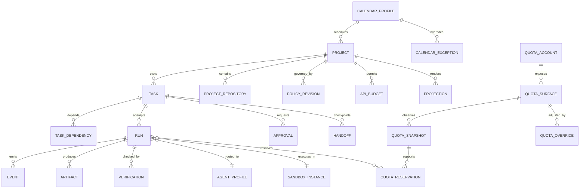

# Canonical data model

## Storage rules

- SQLite is canonical; project Markdown is a validated projection.
- Enable WAL, foreign keys, a busy timeout, and checksums for stored external artifacts.
- Schema changes use ordered migrations. Before migration, create and verify a backup under an exclusive migration lease.
- All mutable aggregate rows have a monotonic `version` for compare-and-swap updates.
- Events and the state change that caused them commit atomically.
- Store timestamps as UTC RFC 3339 values; retain timezone identifiers on deadlines, working hours, and reset interpretations.
- Secrets are references, never values. Large logs/artifacts live in bounded files or a content-addressed store with database metadata.
- Private chain-of-thought is never accepted as an artifact type.

## Entity overview

## Core entities

### `projects`

`id`, `slug`, `title`, `purpose`, `root_path`, `status`, `scheduler_paused`, `scheduler_pause_reason`, `default_policy_revision_id`, `created_at`, `updated_at`, `version`.

Invariants:

- the canonicalised root is unique among active projects;
- removal is archival by default and cannot orphan live tasks;
- an overarching project links repositories explicitly through `project_repositories`.
- a scheduler pause is durable, requires an operator reason, and blocks new claims for only that project.

### `project_repositories`

`id`, `project_id`, `name`, `canonical_path`, `remote_fingerprint`, `role`, `required`, `trust_level`, `default_branch`, `submodule_path`, `pinned_commit`, `created_at`.

Each repository is a trust boundary. Submodule rows are explicit and are not recursively expanded without policy.

### `tasks`

Required fields:

- identity: immutable `id`, `project_id`;
- intent: `title`, `goal`, `rationale`, `scope_json`, `non_scope_json`;
- contract: `acceptance_json`, `verification_commands_json`;
- scheduling: `priority`, optional UTC `deadline_at`, `deadline_timezone`, `expected_benefit`, `risk_class`;
- day scheduling: `day_affinity` (`W`, `O`, or `B`; default `B`) resolved against the project's calendar profile;
- forecast: `estimated_wall_seconds_low/high`, `uncertainty`, `expected_context_bytes`, `checkpoint_strategy_json`, `checkpoint_max_seconds`;
- constraints: required adapter capabilities plus allowed/disallowed agents, models, skills, MCP servers, networks, secret references, path globs, commands, and backends as validated JSON or normalised child tables;
- Git: worktree, branch, base/head commit, repository/submodule revision manifest;
- supervision: `lease_id`, `retry_budget`, `retries_used`, `cancellation_id`;
- routing: latest snapshot/reservation and rationale reference;
- manual routing: an optional all-or-none pinned adapter/provider/account identity; pin and unpin changes require a reason and append an event;
- integration: artifact refs and integration policy revision;
- lifecycle: `status`, timestamps, `version`.

`checkpoint_max_seconds` defaults to 300. A task cannot enter `ready` without acceptance criteria, verification commands or an explicit no-command verification, dependency validation, risk tier, estimates, and checkpoint/rollback strategy.

### `task_dependencies`

`task_id`, `depends_on_task_id`, `kind`, `created_at` with a unique pair and no self-edge. Adding an edge performs cycle detection in the same transaction.

### `calendar_profiles` and `calendar_exceptions`

`calendar_profiles`: `id`, `slug`, `timezone`, `weekly_pattern`, `created_at`, `updated_at`, `version`. `weekly_pattern` contains seven `W`/`O` characters ordered Monday through Sunday and defaults to `WWWWWOO`.

`calendar_exceptions`: `profile_id`, `local_date`, `day_kind`, `reason`, `created_at`, with a unique profile/date pair. An exception overrides the weekly class for exactly one date. Projects reference a calendar profile; the global default is used when no project-specific selection exists.

Scheduler decisions retain the profile ID/version, timezone, local date, resolved class, exception reference where applicable, task affinity, eligibility reason, and next eligible UTC instant so later calendar edits cannot rewrite history.

### `runs`

`id`, `task_id`, `attempt`, `role` (`planner`, `implementer`, `verifier`, `reviewer`), `adapter_id/version`, `agent_profile_id`, `model`, `execution_plane_id/version`, `sandbox_instance_id`, `policy_revision_id`, `route_decision_id`, `base_commit`, `head_commit`, `started_at`, `heartbeat_at`, `checkpoint_due_at`, `ended_at`, `status`, `exit_code`, `failure_category`, `version`.

A run is immutable after terminalisation except for redaction/quarantine metadata and retention state. Planner, implementer, and verifier runs are distinct records. Schema 14 materializes `role` and `parent_run_id`; each verifier is a distinct child of its active implementer rather than a label applied afterward.

### `leases` and `resource_locks`

`leases`: `id`, `task_id`, `run_id`, `owner_instance_id`, `acquired_at`, `heartbeat_at`, `expires_at`, `generation`, `released_at`.

`resource_locks`: `resource_kind`, `resource_key`, `lease_id`, `mode`, `expires_at`.

Lease acquisition is compare-and-swap. Recovery may expire a lease only after its generation and heartbeat are rechecked. Agent/account, worktree, sandbox, updater, migration, and scheduler-leader locks use the same mechanism.

The Phase 2 scheduler represents per-adapter and per-account concurrency as numbered `adapter-slot` and `account-slot` resource locks. Global capacity, both route-specific ceilings, and the project lock are acquired in the same immediate transaction as the task claim. Expiry or release frees all of those locks together.

### `route_decisions`, `scheduler_claims`, and `scheduler_wakes`

`route_decisions` persist the selected adapter/provider/account, allow/deny result, a stable machine `reason_code`, bounded human rationale, every candidate's hard-filter and score components, quota/schedule evidence, policy hash, and evaluation time. Human wording is never parsed to recover the machine reason.

`scheduler_claims` bind a ready task version, fenced scheduler generation, route decision, lease interval, and optional consumed run/action key. Claim creation atomically transitions `ready -> leased` and acquires all resource locks.

`scheduler_wakes` retain the latest exclusion for a task as a stable reason code, optional exact wake time, and bounded supporting detail. Dependency, project pause, calendar, quota, policy, retry, expired deadline, capability, capacity, and resource-lock exclusions use distinct codes.

### `events`

`id`, `sequence`, `project_id`, `task_id`, `run_id`, `type`, `schema_version`, `occurred_at`, `recorded_at`, `actor_kind`, `actor_id`, `idempotency_key`, `payload_json`, `redaction_state`, `previous_digest`, `digest`.

Events are append-only. A per-database or per-project digest chain detects accidental/unauthorised rewriting; it is tamper-evident, not protection against a fully compromised host.

### `approvals`

`id`, `task_id`, `run_id`, `effect_class`, `action_kind`, `action_digest`, `target_json`, `effect_summary`, `command_or_api_json`, `risk`, `reversibility`, `scope_json`, `alternative_json`, `requested_at`, `expires_at`, `decision`, `decided_by`, `decided_at`, `single_use`, `consumed_at`, `policy_revision_id`.

Approval consumption and the authorised transition/action claim commit atomically. Reusable rules become a new policy revision; they are not repeatedly consumed approval rows.

## Quota and budget entities

### `quota_accounts`

`id`, `provider`, `profile_label`, `auth_reference`, `subscription_kind`, `enabled`, `created_at`. The label is non-secret; `auth_reference` points to an external credential provider.

### `quota_surfaces`

`id`, `account_id`, `surface_key`, `kind`, `unit`, `window_kind`, `scope_json`, `user_label`, `enabled`, `policy_json`.

Examples include `five_hour_percent`, `weekly_percent`, `monthly_requests`, `monthly_credits`, and `paid_overage_currency`. Surface keys are adapter-namespaced and stable within a schema version.

### `quota_snapshots`

`id`, `surface_id`, `observed_at`, `valid_until`, `used_value`, `remaining_value`, `limit_value`, `remaining_percent`, `reset_at`, `source`, `source_version`, `confidence`, `unknown_reason`, `raw_artifact_id`.

Unknown is represented by `unknown_reason`, never by `remaining_percent=100` or zero. Provider-reported values and local forecasts use distinct `source` classifications.

The current schema-14 implementation materializes the latest observation in `quota_surfaces`, appends every successful source result to `quota_observations`, and records bounded success/failure evidence in `quota_collection_attempts`. It records `valid_until`, confidence, collector contract, provider version, and a raw-payload SHA-256 digest. Account-bearing raw CodexBar JSON is not stored. An expected Codex/Claude five-hour or weekly lane that is absent from a successful payload becomes an explicit unknown observation. An expired observation is `quota.stale`, distinct from unknown or insufficient quota; a live append-only user override remains visibly separate.

### `quota_usage_samples`

`id`, `evidence_id`, `adapter`, `provider`, `account`, `surface_key`, `estimated_seconds`, `consumed_percent`, `source`, `confidence`, `observed_at`.

Usage samples are explicit append-only telemetry, not differences inferred from account-level snapshots. `(evidence_id, adapter, provider, account, surface_key)` is unique, so collector replay fails rather than double-counting. Accepted confidence classes are `provider_reported`, `collector_measured`, and `user_reported`; agent-authored text is not accepted as measurement evidence.

Schema 13 forecasts the exact adapter/provider/account from at most 50 recent evidence groups. It scales each observation by estimated duration, takes the greatest surface prediction within a group, and uses uncertainty-adjusted nearest-rank P90 after five groups. Sparse histories use the conservative duration fallback. Route evidence records the forecast source and sample count, and the selected forecast is reserved atomically.

### `quota_overrides`

`id`, `surface_id`, `project_id` nullable, `effective_remaining_percent`, `effective_remaining_value`, `effective_reset_at`, `reserve_percent`, `paid_overage_enabled`, `reason`, `actor`, `created_at`, `expires_at`, `supersedes_id`.

Overrides are append-only, scopeable globally or to a project, and may change mid-run. The effective view retains both observed and overridden values.

### `quota_reservations`

`id`, `run_id`, `surface_id`, `snapshot_id`, `reserved_value_low/high`, `reserve_floor`, `expires_at`, `released_at`, `actual_value`, `decision`.

Reservations are forecasts and prevent the local scheduler from overcommitting; they do not reserve provider-side quota.

Schema 11 creates one percentage reservation per relevant surface in the same immediate transaction as the scheduler claim and capacity locks. Claim heartbeat, claim-to-run conversion, runtime checkpoints, completion, failure, cancellation, graceful scheduler stop, emergency stop, and orphan recovery renew or release the reservation with an explicit status/reason. Concurrent claims sum active reservations before admission.

### `api_budgets`, `api_request_plans`, `api_model_prices`, and `api_spend`

Schema 16 materializes the network-free API accounting control plane and durable pricing evidence.

`api_budgets`: `id`, `project_id`, `provider`, `account`, `enabled`, `secret_reference`, `currency`, `currency_limit_micros`, `token_limit`, `request_limit`, `period_start/end`, model/tool/role allowlists, `max_output_tokens`, `max_retries`, `max_concurrent_requests`, `reason`, `created_at`, `supersedes_id`.

Budget revisions are append-only. Secret references are locators with one of three strict forms—`env:NAME`, `keychain:SERVICE/ACCOUNT`, or `file:/absolute/path`—not credential values. Monetary admission uses integer micros and an explicit three-letter currency. At least one currency, token, or request ceiling is mandatory.

`api_request_plans`: append-only `id`, `task_id`, exact `task_version`, provider/account, enabled flag, model/role, per-attempt input/output maxima, retry maximum, streaming flag, template version, request digest, reason, creation time, and superseded revision. Canonical task content is rendered deterministically at admission; the plan does not persist a second prompt copy.

`api_budget_reservations`: `id`, `budget_id`, `project_id`, `task_id`, `provider`, `account`, `model`, `role`, `request_digest`, aggregate worst-case currency/input-token/output-token reservations, reserved request-attempt count, per-attempt input/output maxima, `status`, `created_at`, `expires_at`, `dispatch_claimed_at`, `settled_at`, `release_reason`, `claim_id`, `run_id`.

Reservation admission runs in an immediate transaction and includes committed spend plus every active or dispatched reservation. An undispatched reservation can be released or expires once; claiming dispatch is single-use. After dispatch, uncertain provider outcome retains the reservation until authenticated settlement instead of incorrectly returning budget.

Schema 17 adds the scheduler binding. An exact paid request must be explicitly pinned, is hashed without persisting its prompt, and has its worst-case monetary reservation calculated from the effective price record. The scheduler claim, capacity locks, and reservation commit together or all roll back. Claim heartbeat and claim-to-run conversion renew the bound reservation; stop, expiry, emergency stop, pre-dispatch completion/failure, and orphan recovery release it once. A bound reservation cannot be manually released or dispatched before its claim becomes a run.

Schema 18 adds durable per-task request plans and retry-aware reservation totals. A paid scheduler route must match the latest enabled plan and current task version. Before the claim commits, Garnish multiplies per-attempt currency and token maxima by `1 + max_retries` and reserves the same number of request attempts. Actual retry dispatch is not yet implemented; this schema guarantees budget headroom if that execution loop is added.

`api_model_prices`: `id`, provider/account/model/currency identity, integer-micro rates per million uncached-input/cache-read/cache-creation/output tokens, `effective_from/to`, `source`, `reason`, `created_at`, `supersedes_id`.

Price records are append-only and operator supplied. Garnish never embeds a provider price, model alias, or cache multiplier. An effective record must match the reservation identity and settlement currency exactly.

`api_spend`: `id`, `budget_id`, `reservation_id`, `provider_request_id_hash`, `model`, total/cached/cache-creation input tokens, output tokens, `cost_micros`, `currency`, `pricing_evidence_id`, `source`, `observed_at`.

Settlement is single-use, cannot exceed the claimed maximum, and stores only the provider request-ID hash and bounded usage evidence. Monetary settlement recomputes cost from the cited effective price record with checked integer arithmetic; the categorized input counts cannot exceed the provider-reported input total. Prompts, responses, raw request IDs, and credentials are not accounting fields. Subscription quota never satisfies an API budget and API funds never imply subscription headroom.

## Policy and integration entities

### `policy_revisions`

`id`, `scope_kind`, `scope_id`, `parent_revision_id`, `schema_version`, `document_json`, `content_hash`, `created_by`, `created_at`, `effective_at`, `superseded_at`.

Runs pin the resolved revision and an effective-policy hash. Managed constraints are stored separately and cannot be widened by lower scopes.

### `adapter_installations` and `capability_probes`

Installation: `id`, `kind`, `adapter_key`, `configured_executable`, `config_json`, `enabled`.

Probe: `id`, `installation_id`, `executable_realpath`, `version`, `capabilities_json`, `health`, `evidence_artifact_id`, `probed_at`, `valid_until`, `failure_reason`.

No route uses a stale probe when a required capability could have changed.

Schema 8 implements the probe history as append-only `agent_capability_probes` rows containing adapter key, executable path, version, health, capability JSON, bounded failure detail, observation time, and validity expiry. The latest matrix is selected deterministically per adapter; freshness is computed at read time so an expired healthy observation is reported as stale rather than silently reused.

### `sandbox_instances` and `sandbox_attestations`

Instance: backend, external ID, image ref/digest, worktree mount, state, timestamps, cleanup state.

Attestation: requested spec hash, inspected spec JSON, backend/version, mounts, user, network, resource/security controls, `secure_container`, reasons, evidence artifact, inspected time, expiry.

### `artifacts`

`id`, `run_id`, `kind`, `media_type`, `relative_path` or object key, `size_bytes`, `sha256`, `created_at`, `retention_class`, `redaction_state`, `quarantine_reason`.

Kinds include manifest, stdout/stderr, JSONL events, patch, commit reference, verification, summary, handoff, SBOM, and support bundle. Output is truncated/rotated by policy while retaining a digest and truncation event.

### `verifications`

`id`, `run_id`, `verifier_run_id`, `criterion_id`, `command_argv_json`, `working_directory`, `tool_versions_json`, `started_at`, `ended_at`, `exit_code`, `result`, `output_artifact_id`, `waiver_id`.

The schema-14 slice stores the implementer/verifier link, terminal result, exit code, evidence path, and creation time. The verifier has its own route decision, clean worktree, manifest, output, and verification artifact. The initial `garnish-command-verifier:local:default` identity executes only the task's predeclared argv and does not consume subscription or API quota.

### `handoffs`

`id`, `task_id`, `run_id`, `sequence`, `goal`, `acceptance_json`, Git/repository revision manifest, changed-file summary, command-results JSON, decisions/assumptions, blocker, artifact refs, next safe action, unverified facts, created time, content hash.

### `projections`

`id`, `project_id`, `kind`, `path`, `schema_version`, `database_version`, `content_hash`, `generated_at`, `last_imported_hash`, `conflict_state`.

## State transition invariants

- `draft -> ready`: contract validated; dependency graph acyclic.
- `ready -> leased`: dependencies completed; policy/quota/backend/agent preflight satisfied; active lease and locks created atomically.
- `leased -> planning`: run manifest exists and preflight evidence is durable.
- `planning -> running`: approval is unnecessary or consumed; sandbox attestation and quota reservation are current.
- `running -> verifying`: execution terminal evidence and checkpoint/handoff are stored.
- `verifying -> review`: every required criterion passes or has a valid waiver.
- `review -> completed`: integration policy outcome is recorded; completion never implies push/merge.
- Any terminal or paused transition releases/reduces resources transactionally and schedules cleanup.
- Expired leases transition through recovery logic, not by direct status mutation.

## Projection import

Only documented fields in `PROJECT.md` and `MEMORY.md` are importable initially. The importer:

1. validates the last generated content hash;
2. parses a versioned front matter/schema;
3. rejects unknown security-relevant keys;
4. previews database changes and conflicts;
5. commits supported changes plus events atomically;
6. regenerates projections.

`TASKS.md`, `HANDOFF.md`, run manifests, and event logs are generated/read-only in the MVP.

## Backup, export, and retention

- Use SQLite's online backup API or a consistent equivalent, not a raw copy of an active WAL database.
- Verify backup integrity before migration.
- Export includes schema/version manifest, database backup, selected artifacts, projection hashes, and checksums. Encryption is mandatory when secrets could be inferred from metadata or logs.
- Default retention keeps task summaries, patches, decisions, verification, approvals, quota rationale, and digests; verbose terminal logs rotate and age out according to policy.
- Deletion is a Class 3 effect when it removes persistent evidence still inside retention.
