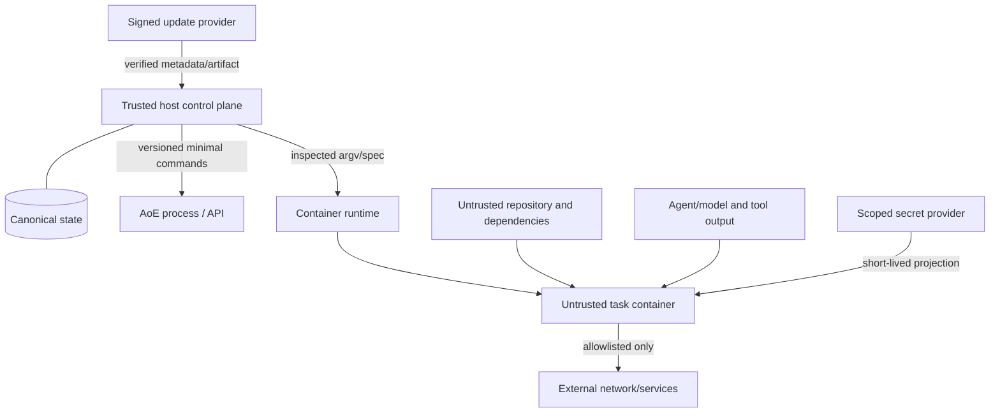

# Threat model

## Scope and security objective

Harness Garnish executes tools against untrusted repositories using valuable subscription sessions, API budgets, source code, and optional credentials. Its objective is to constrain each run to the explicitly authorised project, effects, resources, network, secrets, and time; preserve trustworthy audit evidence; and fail safely when an integration cannot prove those constraints.

A container reduces host exposure but is not a complete trust boundary. The host runtime, kernel/VM, bind mounts, credential projection, network, caches, and control socket remain material.

## Protected assets

- source code, uncommitted user changes, Git history, and repository remotes;
- provider subscription sessions, API keys, OS keychain items, SSH keys, and GitHub tokens;
- global/project policy, approvals, sandbox attestations, and update trust roots;
- canonical SQLite state, events, leases, quota/budget records, and verification evidence;
- data belonging to other projects, accounts, agents, and users;
- host availability, disk, CPU, memory, network reputation, and paid budgets;
- software-update channel and installed Garnish binary.

## Trust boundaries

AoE is a third-party privileged local component, not part of the trusted Rust core. Repository instructions, dependencies, model responses, MCP/tool output, websites, and task containers are untrusted.

## Secure-container attestation

Autonomous Class 1 work requires a current attestation with machine evidence for all applicable controls:

- only declared worktrees are writable project mounts;
- no host home, unrelated repository, orchestration database, SSH agent, keychain, cloud configuration, or container socket/device is mounted;
- secrets are explicit, short-lived, least-privilege, redacted, and removed after the phase;
- non-root container user where supported;
- network off or restricted to the phase's allowlist;
- CPU, memory, PID, disk/output, wall-time, and concurrency limits;
- dropped capabilities, `no-new-privileges`, and platform security profile where supported;
- pinned image digest and recorded provenance;
- isolated dependency cache with a project/trust namespace;
- cancellation reaches descendants and orphan cleanup is tested;
- runtime inspection matches the requested spec.

Failure or inability to inspect any mandatory property yields `secure_container=false`. Product names and command-line flags are not attestations.

## Threats and controls

| Threat | Example | Required controls | Verification |
| --- | --- | --- | --- |
| Prompt injection in repository | `README` tells the agent to upload secrets or weaken policy | Treat repository text as data; policy outside model; no policy DB mount; tool/network/secret allowlists | Malicious-repository fixtures cannot widen grants |
| Hostile MCP/tool/web output | Tool response requests a destructive command | Trust registry, namespaced tools, bounded context, output labelling, deterministic approval gate | Fake MCP attempts are denied and logged |
| Shell injection | Task title embedded into a shell string | Argv arrays, no `shell=true`, validated executables/paths, stdin prompts | Metacharacter and newline property tests |
| Path traversal/symlink escape | Artifact path reaches another project | Canonicalise under opened directory handles where possible; reject `..`, absolute escapes, unsafe symlinks and mounts | Race/symlink fixtures on every backend |
| Secret leakage | Credential appears in argv, env dump, log, diff, crash report | Secret references, file/FD injection where possible, environment allowlist, multi-stage redaction, support bundle opt-in | Canary secrets absent from stored/presented output |
| Credential store sharing | AoE mounts writable global Claude/Codex auth directory | Disable stock sharing; task-scoped read-only projection or host-side authenticated CLI with precise isolation claim | Inspect effective mounts and permissions |
| Host Codex subscription authority escapes task scope | Repository instructions induce Codex to edit broadly, invoke an extension, or disclose saved authentication | Treat project instructions as untrusted; ephemeral JSONL; built-in read-only permissions; no user config, exec-policy rules, MCP, apps, hooks, plugins, multi-agent, web search, or inherited environment; one exact-scope patch applied by Garnish | Fake Codex fixture proves argv/config boundary, exact changed paths, detached verification, and reasoning/secret-canary absence |
| Container escape/amplification | Docker socket allows host control | Never mount runtime socket; rootless backend where practical; drop capabilities/devices; patched runtime | Inspect mounts/devices/security options |
| Cross-project leakage | Shared cache contains another project's source/token | Per-project cache namespaces; no shared writable agent home; account/resource locks | Two-project isolation test with canaries |
| Policy tampering | Agent edits project policy during the run | Resolve/freeze effective policy hash; policy store outside sandbox; current-run authorisation immutable | Tamper attempt leaves decision unchanged and raises event |
| Audit tampering | Agent deletes or rewrites run evidence | Append events transactionally; event digests/sequence; evidence outside worktree or write-once after ingestion | Mutation is detected during verification/export |
| False completion | Agent claims tests passed | Independent verifier in clean sandbox; command exit status and artifacts decide | Fake agent success with failing test cannot complete |
| Dirty-tree loss | Worktree creation overwrites user edits | Preflight status and base snapshot; no destructive Git; task-owned worktrees only | Dirty-tree fixtures remain byte-identical |
| Approval spoof/replay | Old approval reused for broader push | Bind approval to action digest, target, actor, scope, expiry, and nonce; consume one-shot approvals atomically | Replay/expired/altered requests fail |
| Quota/budget overrun | Five-hour quota empties before checkpoint | Per-surface headroom; five-minute maximum checkpoint; shorter guard interval; provider cancellation; API hard budgets | Boundary simulations pause without starting unsafe phase |
| Hidden HTTP replay or credential redirection | Client retries a protocol failure, follows a redirect, or inherits a proxy without a matching durable attempt | Fixed provider HTTPS endpoints; no redirects, proxy inheritance, referrer, or client retries; bounded response identity/type/size checks | Quota-free request-construction and fail-closed boundary fixtures; separately ignored paid smoke test |
| Untrusted API patch escapes task authority | Provider returns binary/link content, extra tool calls, or paths outside declared scope | One typed `submit_patch` tool; 1 MiB UTF-8 limit; structural/type checks; clean isolated worktree; exact post-apply path gate; separate detached verifier | Fake OpenAI/Anthropic accepted-path fixtures and deterministic malformed/type/scope denial tests |
| Resource exhaustion | Fork bomb, unbounded logs/retries/disk | PID/CPU/memory/disk/output limits; retry budget; circuit breaker; global pause and emergency stop | Failure-injection tests and bounded retained evidence |
| Dependency/cache poisoning | One project seeds shared build cache | Pinned setup phase, network separation, trust-scoped caches, lockfile verification/SBOM where required | Cross-project cache tests |
| Unauthenticated control API | LAN actor starts an agent | Loopback binding, bearer/session authentication, CSRF/Host validation, no remote exposure by default | Non-loopback/unauthenticated requests fail |
| Remote approval interception | Tunnel endpoint accepts spoofed response | Defer until SSH/Tailscale authenticated design; bind identity and action digest | No remote adapter in MVP |
| Malicious update | Compromised mirror ships binary | Signed metadata/artifacts, hash verification, channel pinning, staged health check, rollback, no agent policy edits | Wrong signature/hash and rollback tests |
| Migration corruption | Update partially migrates DB | Exclusive migration lease, backup, version checks, transactional migration/compatibility plan | Upgrade/downgrade and restore fixtures |

## AoE-specific risk assessment

AoE offers useful execution features but its documented stock sandbox may share credentials and mount host configuration automatically. Garnish therefore:

1. treats AoE as untrusted-but-authorised local middleware;
2. authenticates its loopback API and never uses `--no-auth`;
3. pins supported AoE/API/plugin versions;
4. sends no secrets in API query strings or logs;
5. verifies worktree ownership independently;
6. requires effective container inspection before granting autonomy;
7. refuses stock mounts that expose `~/.ssh`, global agent homes, the orchestrator database, or unrelated project paths;
8. falls back to Garnish-owned sandbox creation when AoE cannot express the policy.

Polling terminal stability is not authoritative completion. Garnish combines AoE state with process/session evidence, adapter-specific terminal markers where reliable, and independent verification.

## Platform considerations

### macOS

Docker and Podman run through a VM; file sharing and named/anonymous volume behaviour differ from Linux. Apple Container has different volume/network/resource features. Attestation is backend-specific. Keychain access is host-side only unless an explicit secret provider projects a scoped value.

### Linux

Prefer rootless Podman where practical. SELinux relabelling changes host labels and is Class 2. Docker group membership is effectively privileged and is not granted to task containers.

### WSL2

Treat Windows, WSL2, and Docker Desktop boundaries separately. Avoid `/mnt/c` source worktrees for security/performance-sensitive runs by default. Windows credential stores and named-pipe/runtime integration require explicit adapters; Linux paths and permissions are canonical inside the WSL worker.

## Incident and emergency behaviour

- `pause-all` prevents new leases and requests checkpoints from active runs.
- `emergency-stop` durably cancels all runs, terminates descendants, revokes task secret projections, and retains evidence.
- A redaction failure quarantines the artifact rather than displaying or exporting it.
- Suspected policy/audit compromise disables autonomous work until `garnish doctor` validates state and the user acknowledges recovery.
- Garbage collection never deletes evidence or worktrees still referenced by nonterminal tasks, review, retention policy, or an active lease.

## Residual risks

- Container/VM/kernel vulnerabilities cannot be eliminated by Garnish.
- Provider CLIs may change undocumented local storage, output, or authentication behaviour.
- Models can make harmful changes within granted scope; independent verification reduces but does not remove this risk.
- Quota forecasts are uncertain and provider reports may be stale.
- A compromised host can defeat local controls. Garnish protects projects from tasks, not the host from its administrator.
